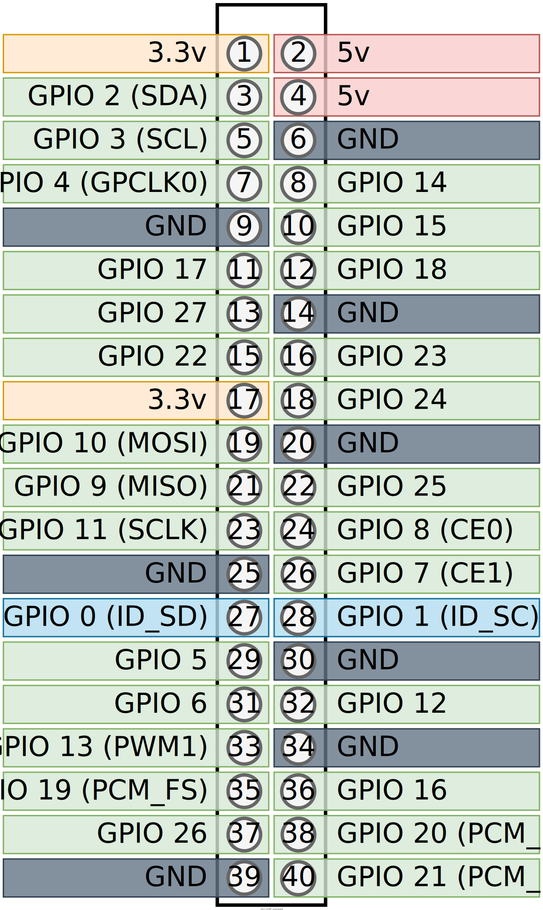
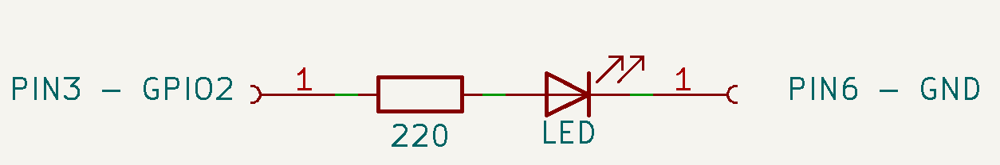
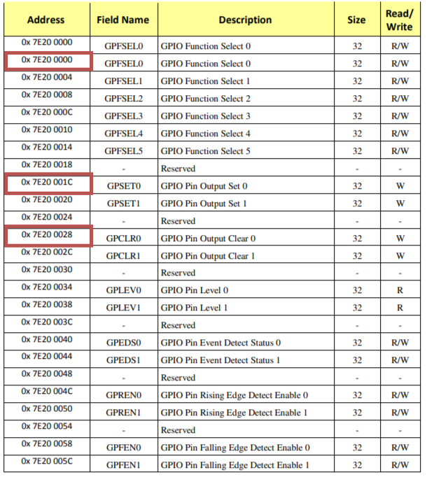

- [Rust bare metal LED driver](#rust-bare-metal-led-driver)
- [TLDR](#tldr)
	- [Compile code into ELF:](#compile-code-into-elf)
	- [Flatten into binary](#flatten-into-binary)
	- [Flash the SD](#flash-the-sd)
	- [Connect](#connect)
	- [Enjoy the blink](#enjoy-the-blink)
- [Hardware setup](#hardware-setup)
	- [The board](#the-board)
	- [The Processor](#the-processor)
	- [LED circuit](#led-circuit)
- [Workflow setup](#workflow-setup)
	- [Configure target architecture](#configure-target-architecture)
	- [Change the main](#change-the-main)
	- [Compile](#compile)
	- [Ouput binary](#ouput-binary)
		- [ELF format](#elf-format)
		- [Installing arm-none-eabi toolchain](#installing-arm-none-eabi-toolchain)
		- [Dumping the binary](#dumping-the-binary)
	- [Linker script](#linker-script)
	- [Compiling with linker script](#compiling-with-linker-script)
	- [Flattening the binary](#flattening-the-binary)
	- [Loading the binary into SD card](#loading-the-binary-into-sd-card)
- [LED blinking](#led-blinking)
	- [GPIO](#gpio)
		- [Addresses](#addresses)
		- [GPIO Addresses](#gpio-addresses)
		- [GPIO Function Select](#gpio-function-select)
		- [GPIO Set and Clear](#gpio-set-and-clear)
		- [Rust Code to blink the LED](#rust-code-to-blink-the-led)
- [Let's see the light!](#lets-see-the-light)
- [Sources](#sources)
- [Images](#images)


# Rust bare metal LED driver
I want to code, compile, and run bare metal code on a raspberry Pi in Rust and blink an LED.

# TLDR
## Compile code into ELF: 
```bash
cargo build --release
```

## Flatten into binary
```bash
arm-none-eabi-objcopy -O binary ./target/armv7a-none-eabi/release/led ./kernel.img
```

## Flash the SD
Load files into FAT32 formated SD card [From this directory](./to_push/) and the kernel.img.

## Connect
Connect an LED on GPIO 2 (PIN 3).

## Enjoy the blink


# Hardware setup
## The board
I'll be using a `Raspberry PI 3 Model B v1.2`.


## The Processor
We first need to find out what processor it's using to get the datasheet for later. We can find out on the [Raspberry PI Website](https://www.raspberrypi.com/documentation/computers/os.html)


The processor is the `Broadcom BCM2837 Arm processor`.

The datasheet : [BCM2837-ARM-Peripherals.pdf](https://cs140e.sergio.bz/docs/BCM2837-ARM-Peripherals.pdf)

## LED circuit
We'll be attaching a random LED in series with a resistor to a Raspberry GPIO.


We can seach for the 40 pins pinout of the raspberry:




[Interactive Pinout](https://pinout.xyz/)

I'm gonna use the `GPIO 2` on `PIN 3` and `PIN 6` for `gnd` because i want to. Here is a schematics of the small circuit we'll be using:



# Workflow setup

The software part is done on a host computer with [Rust installed](https://www.rust-lang.org/tools/install).

We want to compile code for a specific **architecture**, this mean we'll need to **cross-compile** the code because the architecture of our PC is different from the one on the PI. We also want to use it **Bare Metal** which means we don't want it to run on an existing Operating System so we can't use existing OS' libraries.

For that we'll need need to specify the target architecture in a config file of cargo (Cargo is our build system). 

## Configure target architecture

Create .cargo directory:
```bash
mkdir .cargo
``` 

and create a file  `.cargo/config` with:
```toml
[build]
target = "armv7a-none-eabi" 
```

- `armv7a` : The architecture of the processor
- `none` : This means we're not using any underlying Operating system
- `eabi` : Means we're using the extended [ABI](https://fr.wikipedia.org/wiki/Application_binary_interface#:~:text=En%20informatique%2C%20une%20Application%20Binary,diff%C3%A9rentes%20parties%20d'une%20application.)

We'll probably need to install the target architecture:
```bash
rustup target add armv7a-none-eabi
```


## Change the main
The current main uses the `std` library which is not available for our target architecture. We'll need to change it.

Tell the compiler to only use bare metal code and tell it we're gonna take care of the entry point:
```rust
#![no_std]
#![no_main]
```

We'll need to define the entry point of our program:
```rust
#[no_mangle]
pub extern "C" fn _start() -> ! 
{
	loop {}
}
```

- `#[no_mangle]` : Tells the compiler to avoid name mangling (don't change the name of the function)
- `-> !` : Tells the compiler that the function never returns
- `extern "C"` : Exposes to the linker


If the processor crashes, it needs to know what to do. We'll need to define a panic handler:
```rust
use core::panic::PanicInfo;
#[panic_handler]
fn panic(_info: &PanicInfo) -> ! {
	loop {}
}
```

## Compile
We can now compile the code:
```bash
cargo build --release
```


## Ouput binary

### ELF format
We can see the output executable in the Executable and Linkable (ELF) format:
```c
readelf -a .\target\armv7a-none-eabi\release\led
ELF Header:
  Magic:   7f 45 4c 46 01 01 01 00 00 00 00 00 00 00 00 00 
  Class:                             ELF32
  Data:                              2's complement, little endian
  Version:                           1 (current)
  OS/ABI:                            UNIX - System V
  ABI Version:                       0
  Type:                              EXEC (Executable file)
  Machine:                           ARM
  Version:                           0x1
  Entry point address:               0x3F0e4
  Start of program headers:          52 (bytes into file)
  Start of section headers:          472 (bytes into file)
  Flags:                             0x5000200, Version5 EABI, soft-float ABI
  Size of this header:               52 (bytes)
  Size of program headers:           32 (bytes)
  Number of program headers:         5
  Size of section headers:           40 (bytes)
  Number of section headers:         8
  Section header string table index: 6
[ ... ]
No version information found in this file.
Attribute Section: aeabi
File Attributes
  Tag_conformance: "2.09"
  Tag_CPU_arch: v7
  Tag_CPU_arch_profile: Application
  Tag_ARM_ISA_use: Yes
  Tag_THUMB_ISA_use: Thumb-2
  Tag_FP_arch: VFPv3
  Tag_ABI_PCS_R9_use: V6
  Tag_ABI_PCS_GOT_use: direct
  Tag_ABI_FP_denormal: Needed
  Tag_ABI_FP_exceptions: Unused
  Tag_ABI_FP_number_model: IEEE 754
  Tag_ABI_align_needed: 8-byte
  Tag_ABI_align_preserved: 8-byte, except leaf SP
  Tag_ABI_optimization_goals: Aggressive Speed
  Tag_CPU_unaligned_access: None
  Tag_ABI_FP_16bit_format: IEEE 754
```

### Installing arm-none-eabi toolchain
We could dump the binary to see the memory layout but we need an arm toolchain to do that:
```bash
sudo apt install gcc-arm-none-eabi
```

or 

[Install from here](https://mynewt.apache.org/latest/get_started/native_install/cross_tools.html#installing-the-arm-cross-toolchain)

### Dumping the binary
We can now dump the binary:
```bash
arm-none-eabi-objdump -D .\target\armv7a-none-eabi\release\led
```

We can see the **memory layout**:
```c
target/armv7a-none-eabi/release/led:     file format elf32-littlearm


Disassembly of section .ARM.exidx:

000100d4 <.ARM.exidx>:
   100d4:       00010010        andeq   r0, r1, r0, lsl r0
   100d8:       00000001        andeq   r0, r0, r1
   100dc:       0001000c        andeq   r0, r1, ip
   100e0:       00000001        andeq   r0, r0, r1

Disassembly of section .text:

000200e4 <_start>:
   200e4:       eafffffe        b       200e4 <_start>

Disassembly of section .ARM.attributes:

00000000 <.ARM.attributes>:
   0:   00003341        andeq   r3, r0, r1, asr #6
   4:   61656100        cmnvs   r5, r0, lsl #2
   8:   01006962        tsteq   r0, r2, ror #18
   c:   00000029        andeq   r0, r0, r9, lsr #32
  10:   302e3243        eorcc   r3, lr, r3, asr #4
  14:   0a060039        beq     180100 <_start+0x16001c>
  18:   01084107        tsteq   r8, r7, lsl #2
  1c:   030a0209        movweq  r0, #41481      ; 0xa209
  20:   0111000e        tsteq   r1, lr
  24:   00150114        andseq  r0, r5, r4, lsl r1
  28:   01180317        tsteq   r8, r7, lsl r3
  2c:   021e0119        andseq  r0, lr, #1073741830     ; 0x40000006
  30:   01260022                        ; <UNDEFINED> instruction: 0x01260022

Disassembly of section .comment:

00000000 <.comment>:
   0:   6b6e694c        blvs    1b9a538 <_start+0x1b7a454>
   4:   203a7265        eorscs  r7, sl, r5, ror #4
   8:   20444c4c        subcs   r4, r4, ip, asr #24
   c:   302e3531        eorcc   r3, lr, r1, lsr r5
  10:   Address 0x0000000000000010 is out of bounds.
```

## Linker script
The thing is that we need to have the `<_start>` at the beginning of the binary AND we need it to be at address 0x8000 because it's where the Raspi bootloader will loads the binary.

To achieve that we need to create a linker script that will describe the memory layout of our binary ([Source](https://github.com/lowlevellearning/raspberry-pi-baremetal-c/blob/master/linker.ld)).
```cENTRY(_start)

SECTIONS
{
    . = 0x8000;
    .text :
    {
        *(.text._start)
        *(.text*)
    }
    . = ALIGN(4096);
    .rodata :
    {
        *(.rodata)
    }
    . = ALIGN(4096);
    .data :
    {
        *(.data)
    }
    . = ALIGN(4096);
    __bss_start = .;
    .bss :
    {
        bss = .;
        *(.bss)
    }
    .ARM.exidx :
    {
        *(.ARM.exidx*)
    }

    . = ALIGN(4096);
    __bss_end = .;
    __bss_size = __bss_end - __bss_start;
    __end = .;
}
```

We also need to add something on the start to tell the linker to use this to put __start at the beginning of the binary:
```rust
#[no_mangle]
#[link_section = ".text._start"]
pub extern "C" fn _start() -> ! 
{
	loop {}
}
```

## Compiling with linker script
We'll have to add the linker script as argument to rustc by adding this to our `.cargo/config`:
```bash
[target.'cfg(all(target_arch = "arm", target_os = "none"))']
rustflags = ["-C", "link-arg=-Tlinker.ld",]
```

We can now compile our binary with the linker script:
```bash
cargo rustc --release
```

We should now be able to dump the binary and see the start first @`0x8000`:
```bash
arm-none-eabi-objdump -D .\target\armv7a-none-eabi\release\led
```

We can see the **memory layout**:
```c
target/armv7a-none-eabi/release/led:     file format elf32-littlearm

Disassembly of section .text:

00008000 <_start>:
    8000:       eafffffe        b       8000 <_start>

Disassembly of section .ARM.exidx:
[ ... ]

Disassembly of section .ARM.attributes:
[ ... ]

Disassembly of section .comment:
[ ... ]
```

## Flattening the binary
The current binary is in ELF format and we need to flatten it to a raw binary. We can do that with `objcopy` (Included in the `arm-none-eabi` toolchain talked about earlier):
```bash
arm-none-eabi-objcopy -O binary ./target/armv7a-none-eabi/release/led ./kernel.img
```

## Loading the binary into SD card
We need to download some files:
[Raspi Repo with necessary files](https://github.com/raspberrypi/firmware/tree/master/boot)

We need to download and copy the necessary files into the SD:
- `bootcode.bin`
- `fixup.dat`
- `start.elf`

Then add a new ``config.txt`` file with the following content:
```bash
arm_64bit=0
```

We can now copy our binary into the SD card:
```bash
cp ./image.bin /Volumes/boot/
```

And the SD card is ready to be plugged in the Raspi.


# LED blinking
Now that we have a binary that can be loaded by the Raspi bootloader, we can start writing some code.

## GPIO
We want to blink an LED so we need to control the GPIO. The GPIO is controlled by setting some values to addresses in the processor memory. For that we'll need to look at the [BCM2835 Datasheet - ARM Peripherals](https://cs140e.sergio.bz/docs/BCM2837-ARM-Peripherals.pdf) documentation.


GPIO Section is at page 89 : `6. General Purpose I/O (GPIO)`

We've chosen GPIO 2 (Pin 3) and we need to:
- Set the GPIO Function Select 1 to output
- Set the GPIO On and Off

### Addresses
The peripheral addresses are not directly accessed through memory addresses, but are mapped through some stuff, this is why the datasheet says:

> Physical addresses range from 0x3F000000 to 0x3FFFFFFF for peripherals. The bus addresses for peripherals are set up to map onto the peripheral bus address range starting at 0x7E000000. Thus a peripheral advertised here at bus address 0x7Ennnnnn is available at physical address 0x3Fnnnnnn.

This means that each time the datasheet says `0x7Ennnnnn` we need to set `0x3Fnnnnnn` as the actual address.

### GPIO Addresses
These are the 3 addresses we'l need to use:


Converted:
- `0x3F20 0000`: GPIO Function Select 0
- `0x3F20 001C`: GPIO Set 0
- `0x3F20 0028`: GPIO Clear 0

### GPIO Function Select


The GPIO Function Select needs to be set to `001` to set the GPIO as output. We can do that by setting the 3 bits `6 to 8` to `001`:

### GPIO Set and Clear
In order to set and clear the GPIO we need to set the bit corresponding to the GPIO we want to set/clear. For GPIO 2 (Pin 3) we need to set the bit `8` to `1` in the GPIO Set and Clear registers.


### Rust Code to blink the LED
```rust
unsafe
{
	// Set GPIO 2 (PIN 3) as output
	core::ptr::write_volatile(0x3F200000 as *mut u32, 1 << 6);
	loop 
	{
		// Set GPIO 2 (PIN 3) to HIGH
		core::ptr::write_volatile(0x3F20001C as *mut u32, 1 << 2);
		
		// Wait
		for _ in 0..500000
		{
			asm!("nop");
		}
		
		// Set GPIO 2 (PIN 3) to LOW
		core::ptr::write_volatile(0x3F200028 as *mut u32, 1 << 2);
		
		// Wait
		for _ in 0..500000
		{
			asm!("nop");
		}
	}
}
```


# Let's see the light!
We need to:
- Setup the LED circuit
- Compile into ELF
- Flatten the binary
- push it to an SD card
- Boot the Raspi
- Enjoy

And voilà!


# Sources

[BAREMETAL RUST Runs on EVERYTHING, Including the Raspberry Pi](https://www.youtube.com/watch?v=jZT8APrzvc4)  
[BCM2835-ARM-Peripherals.pdf](https://www.raspberrypi.org/app/uploads/2012/02/BCM2835-ARM-Peripherals.pdf)  
[https://www.rust-lang.org](https://www.rust-lang.org)


# Images
[https://live.staticflickr.com/4754/39697205632_dcf16271dd_b.jpg](https://live.staticflickr.com/4754/39697205632_dcf16271dd_b.jpg)