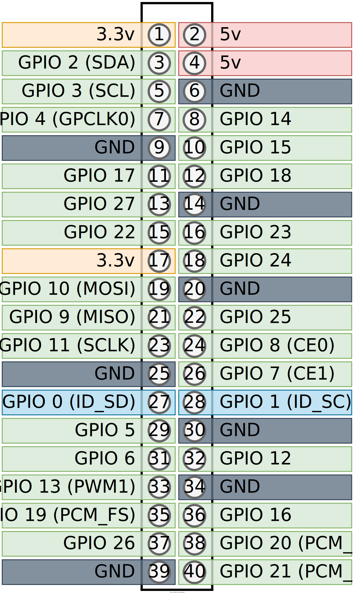
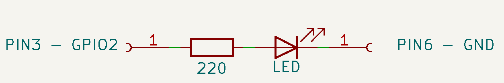

- [Rust bare metal LED driver\*\*](#rust-bare-metal-led-driver)
- [Hardware](#hardware)
	- [The board](#the-board)
	- [The Processor](#the-processor)
	- [LED circuit](#led-circuit)
- [Software](#software)
	- [Configure target architecture](#configure-target-architecture)
	- [Change the main](#change-the-main)
	- [Compile](#compile)
	- [Ouput binary](#ouput-binary)
	- [Linker script](#linker-script)
- [Sources](#sources)
- [Images](#images)


# Rust bare metal LED driver**
I want to code, compile, and run bare metal code on a raspberry Pi in Rust and blink an LED.

# Hardware
## The board
I'll be using a `Raspberry PI Zero W Rev 1.1`.


## The Processor
We first need to find out what processor it's using to get the datasheet for later. We can find out on the [Raspberry PI Website](https://www.raspberrypi.com/documentation/computers/os.html)

Or if you already have a linux on the board:

```bash
pi@raspberry:~ $ cat /proc/cpuinfo
```

My output was:
```bash
processor       : 0
model name      : ARMv6-compatible processor rev 7 (v6l)
BogoMIPS        : 697.95
Features        : half thumb fastmult vfp edsp java tls
CPU implementer : 0x41
CPU architecture: 7
CPU variant     : 0x0
CPU part        : 0xb76
CPU revision    : 7

Hardware        : BCM2835
Revision        : 9000c1
Model           : Raspberry Pi Zero W Rev 1.1
```


The processor is the `Broadcom BCM2835 Arm processor`.

The datasheet : [BCM2835-ARM-Peripherals.pdf](https://www.raspberrypi.org/app/uploads/2012/02/BCM2835-ARM-Peripherals.pdf)

## LED circuit
We'll be attaching a random LED in series with a resistor to a Raspberry GPIO.


We can seach for the 40 pins pinout of the raspberry:




[Interactive Pinout](https://pinout.xyz/)

I'm gonna use the `GPIO 14` on `PIN 8` and `GPIO 1` for ``3.3v` because i want to. Here is a schematics of the small circuit we'll be using:



I chose to setup the led's **anode** to 3.3v so i need to pull the pin to the ground to turn it on. I picked `220 ohm` because it's what i had and the LED drops about 2V. I should be able to draw around `6 mA` when pulling the pin to ground. It's important to setup the pin as **Open drain** too. 

$$
led\_current = 3.3 - 2 / 220 = 1.3 / 220 ~= 6 mA
$$

# Software

The software part is done on a host computer with [Rust installed](https://www.rust-lang.org/tools/install).

We want to compile code for a specific **architecture**, this mean we'll need to **cross-compile** the code because the architecture of our PC is different from the one on the PI. We also want to use it **Bare Metal** which means we don't want it to run on an existing Operating System so we can't use existing OS' libraries.

For that we'll need need to specify the target architecture in a config file of cargo (Cargo is our build system). 

## Configure target architecture

Create .cargo directory:
```bash
mkdir .cargo
``` 

and create a file  `.cargo/config` with:
```toml
[build]
target = "armv7a-none-eabi" 
```

- `armv7a` : The architecture of the processor
- `none` : This means we're not using any underlying Operating system
- `eabi` : Means we're using the extended [ABI](https://fr.wikipedia.org/wiki/Application_binary_interface#:~:text=En%20informatique%2C%20une%20Application%20Binary,diff%C3%A9rentes%20parties%20d'une%20application.)

We'll probably need to install the target architecture:
```bash
rustup target add armv7a-none-eabi
```


## Change the main
The current main uses the `std` library which is not available for our target architecture. We'll need to change it.

Tell the compiler to only use bare metal code and tell it we're gonna take care of the entry point:
```rust
#![no_std]
#![no_main]
```

We'll need to define the entry point of our program:
```rust
#[no_mangle]
pub extern "C" fn _start() -> ! 
{
	loop {}
}
```

- `#[no_mangle]` : Tells the compiler to avoid name mangling (don't change the name of the function)
- `-> !` : Tells the compiler that the function never returns
- `extern "C"` : Exposes to the linker


If the processor crashes, it needs to know what to do. We'll need to define a panic handler:
```rust
use core::panic::PanicInfo;
#[panic_handler]
fn panic(_info: &PanicInfo) -> ! {
	loop {}
}
```

## Compile
We can now compile the code:
```bash
cargo build --release
```


## Ouput binary
We can see the output executable in the Executable and Linkable (ELF) format:
```c
readelf -a .\target\armv7a-none-eabi\release\led
ELF Header:
  Magic:   7f 45 4c 46 01 01 01 00 00 00 00 00 00 00 00 00 
  Class:                             ELF32
  Data:                              2's complement, little endian
  Version:                           1 (current)
  OS/ABI:                            UNIX - System V
  ABI Version:                       0
  Type:                              EXEC (Executable file)
  Machine:                           ARM
  Version:                           0x1
  Entry point address:               0x200e4
  Start of program headers:          52 (bytes into file)
  Start of section headers:          472 (bytes into file)
  Flags:                             0x5000200, Version5 EABI, soft-float ABI
  Size of this header:               52 (bytes)
  Size of program headers:           32 (bytes)
  Number of program headers:         5
  Size of section headers:           40 (bytes)
  Number of section headers:         8
  Section header string table index: 6
[ ... ]
No version information found in this file.
Attribute Section: aeabi
File Attributes
  Tag_conformance: "2.09"
  Tag_CPU_arch: v7
  Tag_CPU_arch_profile: Application
  Tag_ARM_ISA_use: Yes
  Tag_THUMB_ISA_use: Thumb-2
  Tag_FP_arch: VFPv3
  Tag_ABI_PCS_R9_use: V6
  Tag_ABI_PCS_GOT_use: direct
  Tag_ABI_FP_denormal: Needed
  Tag_ABI_FP_exceptions: Unused
  Tag_ABI_FP_number_model: IEEE 754
  Tag_ABI_align_needed: 8-byte
  Tag_ABI_align_preserved: 8-byte, except leaf SP
  Tag_ABI_optimization_goals: Aggressive Speed
  Tag_CPU_unaligned_access: None
  Tag_ABI_FP_16bit_format: IEEE 754
```

We could dump the binary to see the memory layout but we need an arm toolchain to do that:
```bash
sudo apt install gcc-arm-none-eabi
```

We can now dump the binary:
```bash
arm-none-eabi-objdump -D .\target\armv7a-none-eabi\release\led
```

We can see the **memory layout**:
```c
target/armv7a-none-eabi/release/led:     file format elf32-littlearm


Disassembly of section .ARM.exidx:

000100d4 <.ARM.exidx>:
   100d4:       00010010        andeq   r0, r1, r0, lsl r0
   100d8:       00000001        andeq   r0, r0, r1
   100dc:       0001000c        andeq   r0, r1, ip
   100e0:       00000001        andeq   r0, r0, r1

Disassembly of section .text:

000200e4 <_start>:
   200e4:       eafffffe        b       200e4 <_start>

Disassembly of section .ARM.attributes:

00000000 <.ARM.attributes>:
   0:   00003341        andeq   r3, r0, r1, asr #6
   4:   61656100        cmnvs   r5, r0, lsl #2
   8:   01006962        tsteq   r0, r2, ror #18
   c:   00000029        andeq   r0, r0, r9, lsr #32
  10:   302e3243        eorcc   r3, lr, r3, asr #4
  14:   0a060039        beq     180100 <_start+0x16001c>
  18:   01084107        tsteq   r8, r7, lsl #2
  1c:   030a0209        movweq  r0, #41481      ; 0xa209
  20:   0111000e        tsteq   r1, lr
  24:   00150114        andseq  r0, r5, r4, lsl r1
  28:   01180317        tsteq   r8, r7, lsl r3
  2c:   021e0119        andseq  r0, lr, #1073741830     ; 0x40000006
  30:   01260022                        ; <UNDEFINED> instruction: 0x01260022

Disassembly of section .comment:

00000000 <.comment>:
   0:   6b6e694c        blvs    1b9a538 <_start+0x1b7a454>
   4:   203a7265        eorscs  r7, sl, r5, ror #4
   8:   20444c4c        subcs   r4, r4, ip, asr #24
   c:   302e3531        eorcc   r3, lr, r1, lsr r5
  10:   Address 0x0000000000000010 is out of bounds.
```

## Linker script
The thing is that we need to have the `<_start>` at the beginning of the binary AND we need it to be at address 0x8000 because it's where the Raspi bootloader will loads the binary.

To achieve that we need to create a linker script that will describe the memory layout of our binary ([Source](https://github.com/lowlevellearning/raspberry-pi-baremetal-c/blob/master/linker.ld)).
```c
ENTRY(_start)
 
SECTIONS
{
    . = 0x8000;
    .text :
    {
        *(.text.__start)
        *(.text)
    }
    . = ALIGN(4096);
    .rodata :
    {
        *(.rodata)
    }
    . = ALIGN(4096);
    .data :
    {
        *(.data)
    }
    . = ALIGN(4096);
    __bss_start = .;
    .bss :
    {
        bss = .;
        *(.bss)
    }
    . = ALIGN(4096); 
    __bss_end = .;
    __bss_size = __bss_end - __bss_start;
    __end = .;
}
```

We also need to add some **global assembly** in the main to tell the linker to put the start first:
```rust
mod boot{
	use core::arch::global_asm;
	global_asm!(".section .text.__start");
}
```

We can now compile our binary with the linker script:
```bash
cargo rustc --release -- -C link-arg=--script=./linker.ld
```

We can now dump the binary:
```bash
arm-none-eabi-objdump -D .\target\armv7a-none-eabi\release\led
```

# Sources

[BAREMETAL RUST Runs on EVERYTHING, Including the Raspberry Pi](https://www.youtube.com/watch?v=jZT8APrzvc4)  
[BCM2835-ARM-Peripherals.pdf](https://www.raspberrypi.org/app/uploads/2012/02/BCM2835-ARM-Peripherals.pdf)  
[https://www.rust-lang.org](https://www.rust-lang.org)


# Images
[https://live.staticflickr.com/4754/39697205632_dcf16271dd_b.jpg](https://live.staticflickr.com/4754/39697205632_dcf16271dd_b.jpg)
