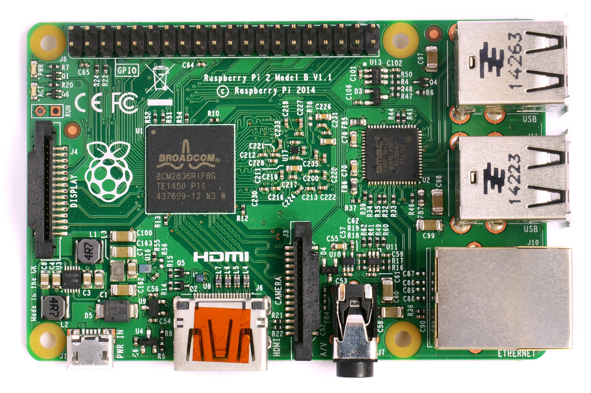

- [Rust bare metal LED driver\*\*](#rust-bare-metal-led-driver)
- [Hardware](#hardware)
	- [The board](#the-board)
	- [The Processor](#the-processor)
	- [LED circuit](#led-circuit)
- [Software](#software)
- [Sources](#sources)
- [Images](#images)


# Rust bare metal LED driver**
I want to code, compile, and run bare metal code on a raspberry Pi in Rust and blink an LED.

# Hardware
## The board
I'll be using a `Raspberry PI Zero W Rev 1.1`.



## The Processor
We first need to find out what processor it's using to get the datasheet for later. We can find out on the [Raspberry PI Website](https://www.raspberrypi.com/documentation/computers/os.html)

Or if you already have a linux on the board:

```bash
pi@raspberry:~ $ cat /proc/cpuinfo
```

My output was:
```bash
processor       : 0
model name      : ARMv6-compatible processor rev 7 (v6l)
BogoMIPS        : 697.95
Features        : half thumb fastmult vfp edsp java tls
CPU implementer : 0x41
CPU architecture: 7
CPU variant     : 0x0
CPU part        : 0xb76
CPU revision    : 7

Hardware        : BCM2835
Revision        : 9000c1
Model           : Raspberry Pi Zero W Rev 1.1
```


The processor is the `Broadcom BCM2835 Arm processor`.

The datasheet : [BCM2835-ARM-Peripherals.pdf](https://www.raspberrypi.org/app/uploads/2012/02/BCM2835-ARM-Peripherals.pdf)

## LED circuit
We'll be attaching a random LED in series with a resistor to a Raspberry GPIO.


We can seach for the 40 pins pinout of the raspberry or we can use mine:


I'm gonna use the `GPIO 14` on `PIN 8` and `GPIO 1` for ``3.3v` because i want to. Here is a schematics of the small circuit we'll be using:


I chose to setup the led's **anode** to 3.3v so i need to pull the pin to the ground to turn it on. I picked `220 ohm` because it's what i had and the LED drops about 2V. I should be able to draw around `6 mA` when pulling the pin to ground. It's important to setup the pin as **Open drain** too. 

$$
led\_current = 3.3 - 2 / 220 = 1.3 / 220 ~= 6 mA
$$

# Software

The software part is done on a host computer with [Rust installed](https://www.rust-lang.org/tools/install).

1. 
# Sources

[BAREMETAL RUST Runs on EVERYTHING, Including the Raspberry Pi](https://www.youtube.com/watch?v=jZT8APrzvc4)

[BCM2835-ARM-Peripherals.pdf](https://www.raspberrypi.org/app/uploads/2012/02/BCM2835-ARM-Peripherals.pdf)

[https://www.rust-lang.org](https://www.rust-lang.org)


# Images
[https://live.staticflickr.com/4754/39697205632_dcf16271dd_b.jpg](https://live.staticflickr.com/4754/39697205632_dcf16271dd_b.jpg)
